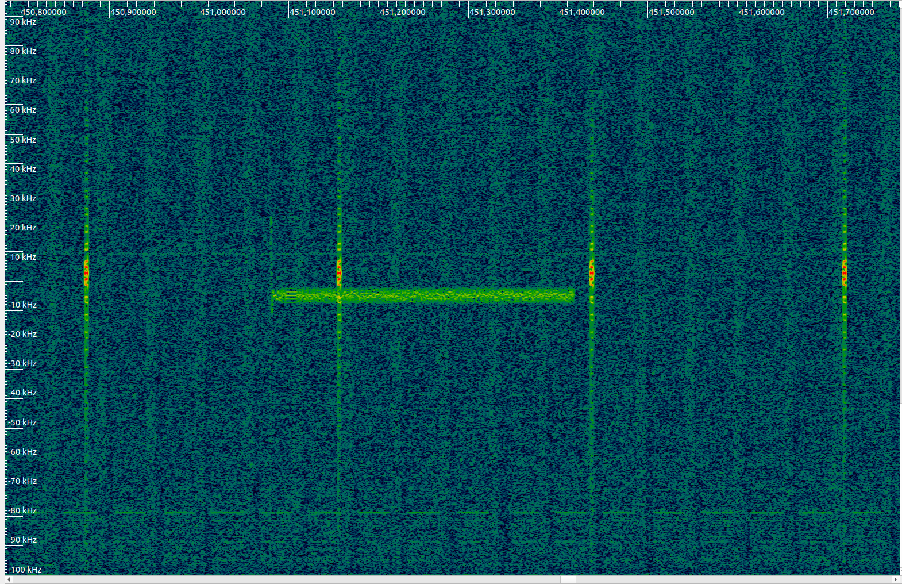

# TALIR01 - Automatic radio telescope

TALIR01 is a construction of an amateur radio telescope and satellite ground station being built at Svákov observatory, Soběslav, Czechia. It uses a parabolic dish antenna on motorized mount.

This repository holds documentation and software related to the construction.

## Parameters

| Parameter | Value | Description |
|-----------|-------|-------------|
| Transceiver | ADALM-PLUTO |  |
| Dish diameter | 3.2 meters |  |
| Slew rate | 20°/s |  |
| Operating frequency range | 325 MHz to 3.8 GHz |  Limited by antenna radiator |

## Obsarvation projects 

### Socrat-R satellite 

The radiotelescope is used for reception of data from  on-board instruments at Soctrat-R cobesat. 

## References

  * [The new radio telescope TALIR 01 will receive signals also from the SPACEDOS dosimeter](http://www.ujf.cas.cz/en/news/The-new-radio-telescope-Talir-01-will-receive-signals-also-from-the-SPACEDOS-dosimeter/)
